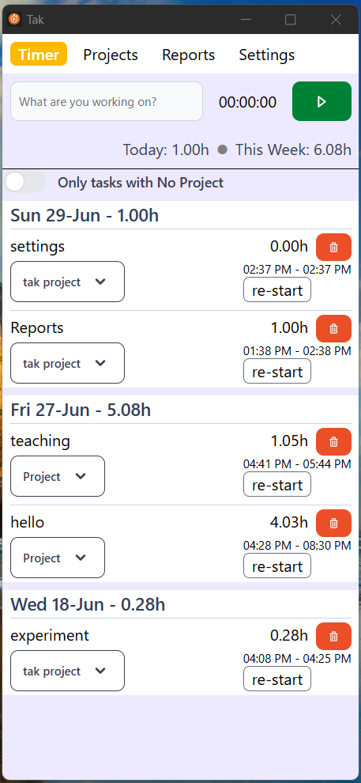

# Tak

`tak` is a desktop app timer. It allows to record the time of tasks your are
working on, assign them to a project and see weekly reports.

## Getting Started

- Download the repo
- Build the executable: `deno task install && deno task dist`
- Run the executable

> [!NOTE]
> The Data is saved locally in a `.tak` folder where the executable. If you move
> the excutable, also move the folder or you will loose your data.

## To develop:

- `deno task install`
- `deno task seed` (optional - seed task for today and yesterday)
- `deno task dev`

## Architecture

- UI uses svelteKit with flowbite-svelte and tailwindcss.
- Backend uses deno and [deno-webui](https://github.com/webui-dev/deno-webui)
- Database is deno kv
